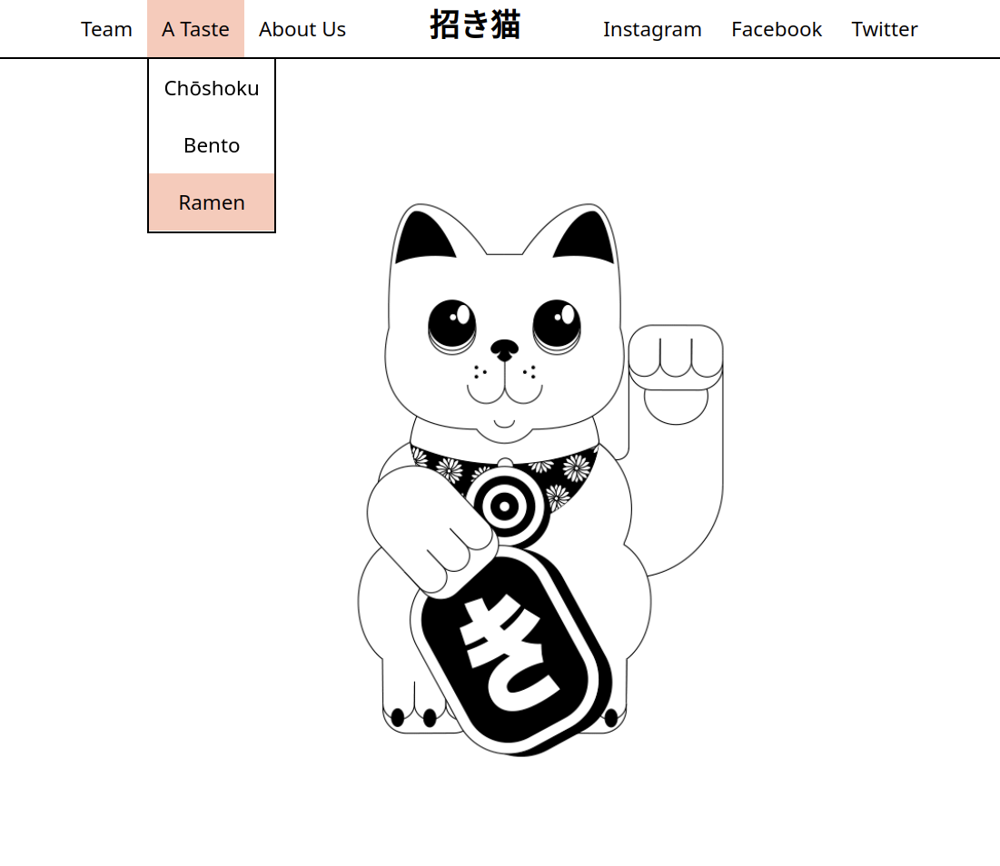

  
  <h1>Japanese Restaurant</h1>
  
A website for a Japanese restaurant.

  
  <a href="https://maneki-neko.netlify.app/"><h3>Try me!</h3></a>

## Technologies Used

&nbsp;&nbsp;&nbsp;&nbsp;&nbsp;&nbsp;

&nbsp;&nbsp;&nbsp;&nbsp;&nbsp;&nbsp;

&nbsp;&nbsp;&nbsp;&nbsp;&nbsp;&nbsp;

&nbsp;&nbsp;&nbsp;&nbsp;&nbsp;&nbsp;

## Description
A JavaScript single-page application (SPA) showcasing the use of ES6 modules.

## Screenshot

## License

Copyright (c) 2022 Michael Kolesidis 
Licensed under the [GNU General Public License v3.0](https://github.com/michaelkolesidis/webproject-script/blob/main/LICENSE).

[//]: # (Free Software)

   
   

  

                                                       

  

